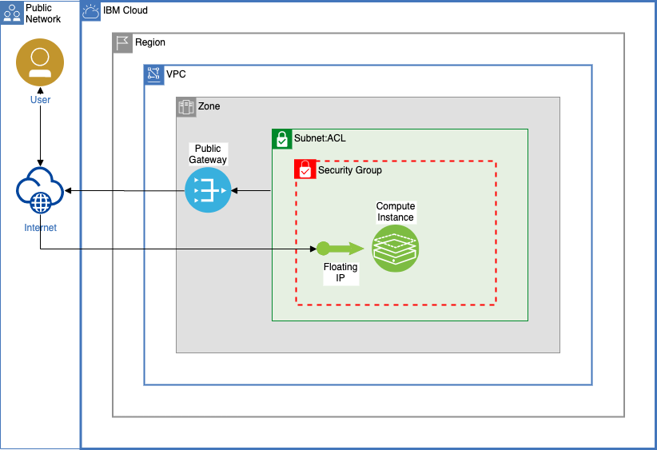

## VPC Gen 2 Example
This example will deploy an IBM Cloud Gen 2 VPC as well as:
 - A public gateway for outbound compute instance traffic.
 - A subnet to use for your compute instances. 
 - A default security group that allows inbound SSH Access from a single IP, inbound ICMP, and allows all outbound traffic. 
 - A single compute instance. The compute instance will be created in the first zone of the region.
 - A floating IP to connect to your compute instance over the public internet.

> This code is written to work with Terraform 0.13 and above. If you would like to work with multiple versions of Terraform on the same machine take a look at [tfswitch](https://github.com/warrensbox/terraform-switcher). 

## Default Zone
 - The subnet and compute instance will be created in the first zone of the region. If you would like to target one of the other zones change all instances of `data.ibm_is_zones.regional_zones.zones[0]` to:
    - `data.ibm_is_zones.regional_zones.zones[1]` to target the second zone in the region or `data.ibm_is_zones.regional_zones.zones[2]` to target the third zone in the region. 

## To use this code
**Step 1: Clone repo**

```shell
$ git clone https://github.com/greyhoundforty/IBMCloud-Terraform-Examples.git
$ cd VPC-Gen2
```

**Step 2: Generate SSH key pair**
In order to connect to our VPC compute instance we'll need to use an SSH key. To generate a new SSH key run the following command. By default the Public key you need to add to the `terraform.tfvars.example` file will be stored at `~/.ssh/id_rsa.pub`. 

```shell
ssh-keygen -t rsa -b 4096 -C "user_id"
```

**Step 3: Update example `.tfvars` file**
You will need to update the `terraform.tfvars.example` and then rename it so that Terraform picks up the variables. The file has comments for each item that you need to provide. When done updating the file rename it:

```shell
$ cp terraform.tfvars.example terraform.tfvars
```

**Step 4: Initialize Terraform**
The `version.tf` file will automatically download the most up to date version of the IBM Cloud Terraform Provider when you initialize the directory.

```shell
$ terraform init
```

**Step 5: Create Terraform plan**
If the `terraform init` command completed without error you are now ready to create a plan for your deployment.

```shell
$ terraform plan -out default.tfplan 
```

**Step 6: Apply generated plan**
If our plan generated successfully we can now deploy our resources using the `apply` command.

```shell
$ terraform apply default.tfplan
```

## Example deployment diagram
The default deployment will look something like this:


